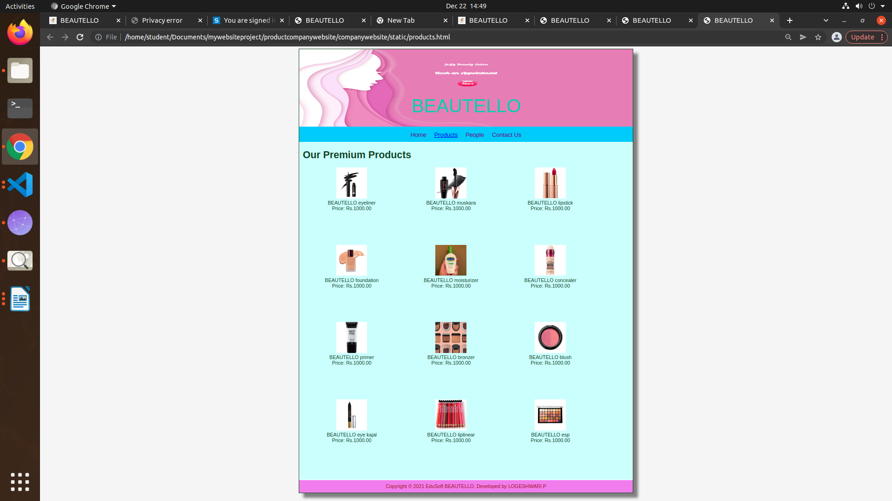

# Web Design for a Software Product Company

## AIM:

To design a static website for a software product company company.

## DESIGN STEPS:

### Step 1:

Requirement collection.

### Step 2:

Creating the layout using HTML and CSS.

### Step 3:

Updating the sample content.

### Step 4:

Choose the appropriate style and color scheme.

### Step 5:

Validate the layout in various browsers.

### Step 6:

Validate the HTML code.

### Step 6:

Publish the website in the given URL.

## PROGRAM :

##HOME:
```
<!DOCTYPE html>
<html lang="en">
  <head>
    <title>BEAUTELLO</title>
    <link rel="stylesheet" href="./css/layout.css" />
    <link rel="icon" href="./img/beauty logo.jpg" type="image/x-icon" />
  </head>

  <body>
    <div class="container">
      <div class="banner">BEAUTELLO</div>
      <div class="menu">
        <div class="menuitemselected"><a href="/static/home.html">Home</a></div>
        <div class="menuitem"><a href="/static/products.html">Products</a></div>
        <div class="menuitem"><a>People</a></div>
        <div class="menuitem"><a>Contact Us</a></div>
      </div>
      <div class="content">
        <div class="homecontent">
          <h1>About Us</h1>
          
          <div class="contenttext">
            I am digital marketer who is passinate about helping small business with 
            'out of the box' ideas to acquire new leads and customers leveraging digital 
            marketing technology . I have a background in the fasion industry in marketing 
            and merchanding with leading brands such as Tommy Hilfiger,J C Penney,and Li and Fung.
            I am a certified facilitator with ACTA certification from singapore WDA 
            I provide consulting,digital marketing and training services to companies to help them 
            make the most of digital marketing
            <br />
            Many consumers now discover beauty products on social media like instagram and youtube.
            so it's no suprise that both new and legancy brands are turning increasingly spending
            on digital media,in order to generate engagement and drive sales 
            <ul>
              <li>Beauty, to me ,is about being comfortable in your own skin.</li>
              <li>Makeup is art .beauty is spirit</li>
              <li>skin first.makeup second.smile always</li>
            </ul>
          </div>
        </div>
      </div>
      <div class="footer">
        Copyright &#169; 2021 BEAUTELLO, Developed by LOGESHWARI.P
      </div>
    </div>
  </body>
</html>
```

##PRODUCT:
```
!DOCTYPE html>
<html lang="en">
  <head>
    <title>BEAUTELLO</title>
    <link rel="stylesheet" href="./css/layout.css" />
    <link rel="icon" href="./img/beauty logo.png" type="image/x-icon" />
  </head>

  <body>
    <div class="container">
      <div class="banner">BEAUTELLO</div>
      <div class="menu">
        <div class="menuitem"><a href="/static/home.html">Home</a></div>
        <div class="menuitemselected">
          <a href="/static/products.html">Products</a>
        </div>
        <div class="menuitem"><a>People</a></div>
        <div class="menuitem"><a>Contact Us</a></div>
      </div>
      <div class="content">
        <div class="productcontent">    
          <h1>Our Premium Products</h1>
          <div class="productitems">
              <div class="productitem"> 
                  <div class="itemimage">
                  
                  </div>
                  <div class="itemname">BEAUTELLO eyeliner</div>
                  <div class="itemprice">Price: Rs.1000.00 </div>
              </div>
              <div class="productitem"> 
                  <div class="itemimage">
                  
                  </div>
                  <div class="itemname">BEAUTELLO muskara</div>
                  <div class="itemprice">Price: Rs.1000.00</div>
              </div>

              <div class="productitem"> 
                <div class="itemimage">
                
                </div>
                <div class="itemname">BEAUTELLO lipstick</div>
                <div class="itemprice">Price: Rs.1000.00</div>
              </div>
              <div class="productitem"> 
                <div class="itemimage">
                
                </div>
                <div class="itemname">BEAUTELLO foundation</div>
                <div class="itemprice">Price: Rs.1000.00</div>
            </div>
            <div class="productitem"> 
              <div class="itemimage">
              
              </div>
              <div class="itemname">BEAUTELLO moisturizer</div>
              <div class="itemprice">Price: Rs.1000.00</div>
            </div>
            <div class="productitem"> 
              <div class="itemimage">
              
              </div>
              <div class="itemname">BEAUTELLO concealer</div>
              <div class="itemprice">Price: Rs.1000.00</div>
            </div>
            <div class="productitem"> 
              <div class="itemimage">
              
              </div>
              <div class="itemname">BEAUTELLO primer</div>
              <div class="itemprice">Price: Rs.1000.00</div>
            </div>
            <div class="productitem"> 
              <div class="itemimage">
              
              </div>
              <div class="itemname">BEAUTELLO bronzer</div>
              <div class="itemprice">Price: Rs.1000.00</div>
            </div>
            <div class="productitem"> 
              <div class="itemimage">
              
              </div>
              <div class="itemname">BEAUTELLO blush</div>
              <div class="itemprice">Price: Rs.1000.00</div>
            </div>
            <div class="productitem"> 
              <div class="itemimage">
              
              </div>
              <div class="itemname">BEAUTELLO eye kajal</div>
              <div class="itemprice">Price: Rs.1000.00</div>
            </div>
            <div class="productitem"> 
              <div class="itemimage">
              
              </div>
              <div class="itemname">BEAUTELLO liplinear</div>
              <div class="itemprice">Price: Rs.1000.00</div>
            </div>
            <div class="productitem"> 
              <div class="itemimage">
              
              </div>
              <div class="itemname">BEAUTELLO esp</div>
              <div class="itemprice">Price: Rs.1000.00</div>
            </div>
          </div>
          </div>        
      </div>
      <div class="footer">
        Copyright &#169; 2021 EduSoft BEAUTELLO, Developed by LOGESHWARI.P
      </div>
    </div>
  </body>
</html>
```
##PEOPLE:
```
!DOCTYPE html>
<html lang="en">
  <head>
    <title>BEAUTELLO</title>
    <link rel="stylesheet" href="./css/layout.css" />
    <link rel="icon" href="./img/beauty logo.png" type="image/x-icon" />
  </head>

  <body>
    <div class="container">
      <div class="banner">BEAUTELLO</div>
      <div class="menu">
        <div class="menuitem"><a href="/static/home.html">Home</a></div>
        <div class="menuitemselected">
          <a href="/static/products.html">Products</a>
        </div>
        <div class="menuitem"><a>People</a></div>
        <div class="menuitem"><a>Contact Us</a></div>
      </div>
      <div class="content">
        <div class="peoplecontent">    
          <h1>Our Premium Products</h1>
          <div class="peopleitems">
              <div class="peopleitem"> 
                  <div class="peopleimage">
                  
                  </div>
                  <div class="itemname">MIA BELLA</div>
              </div>
              <div class="productitem"> 
                  <div class="itemimage">
                  
                  </div>
                  <div class="itemname">TRES BEAUX</div>
              </div>

              <div class="productitem"> 
                <div class="itemimage">
                
                </div>
                <div class="itemname">BELLE CURIS</div>
              </div>
          </div>        
      </div>
      <div class="footer">
        Copyright &#169; 2021 EduSoft BEAUTELLO, Developed by LOGESHWARI.P
      </div>
    </div>
  </body>
</html>
```
##CONTACTUS:
```
!DOCTYPE html>
<html lang="en">
  <head>
    <title>BEAUTELLO</title>
    <link rel="stylesheet" href="./css/layout.css" />
    <link rel="icon" href="./img/beauty logo.png" type="image/x-icon" />
  </head>

  <body>
    <div class="container">
      <div class="banner">BEAUTELLO</div>
      <div class="menu">
        <div class="menuitem"><a href="/static/home.html">Home</a></div>
        <div class="menuitemselected">
          <a href="/static/products.html">Products</a>
        </div>
        <div class="menuitem"><a>People</a></div>
        <div class="menuitem"><a>Contact Us</a></div>
      </div>
      <div class="content">
        <div class="contact content">    
          <h1>CONTACTUS</h1>
          <div class="contactitems">
              <div class="contactitem"> 
                  <h2>UAE</h2><br>
                  <div class="conadd">unit no:741,DNCC business center level no 1,<br>
                    jewellery and gemplex 3,<br>
                    dubai united arab emirates<br>
                    <br>
              </div>
              <div class="conadd">mobile: +91 20 66813232</div> 
                  <div class="conem">email: info@beautello.com</div>
                  <h2>INDIA</h2><br>
                  <div class="conadd">PRODUCT TECHNOLOGIES LIMITED<br>
                    <br>
                    CIN-L72200MH1995PLC091408, marval edge,<br>
                    office no.7010 C&D,7th floor,viman nagar,<br>
                    pune 411014 maharashtra,india<br></div>
                    <br>
                    <div class="conadd">mobile: +91 20 66813232</div> 
                  <div class="conem">email: info@beautello.com</div>
                  <h2>INDIA</h2><br>
                  <div class="conadd">BEAUTELLO INDIA KK.<br>
                <br>
                <div class="conadd">mobile: +91 20 66813232</div> 
                <div class="conem">email: info@beautello.com</div>
                  </div>        
      </div>
      <div class="footer">
        Copyright &#169; 2021 EduSoft BEAUTELLO, Developed by LOGESHWARI.P
      </div>
    </div>
  </body>
</html>
```

## OUTPUT:

### Home Page:


###PRODUCT PAGE:


###PEOPLE PAGE:


###CONTACTUS PAGE:


## Result:

Thus a website is designed for the software product company and the HTML,CSS code are validated.
